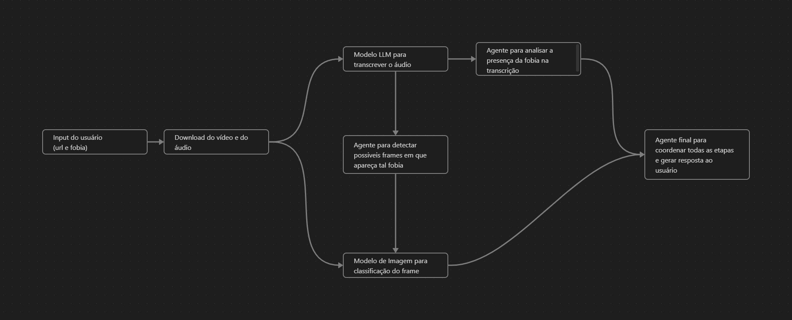

# Phobia Advisor

Detecção de temas em vídeos com Agentes de LLM

## Descrição

Este projeto permite que os usuários enviem links de videos do youtube e uma fobia da qual queira verificar 
a ocorrencia no vídeo em questão e após análise o programa retorna uma resposta sobre se o usuário 
deve ou não assistir o conteúdo.

## Esquema 

## Funcionalidades
- Transcrição de áudio via **Whisper** (OpenAI)
- Análise de transcrição usando **AutoGen** e **GPT-3.5**
- Análise de frames do vídeo utilizando modelo **BLIP**

## Tecnologias Utilizadas
- **Linguagem**: Python
- **Bibliotecas**:
    - OpenAI
    - Gradio
    - BLIP
    - pyTube