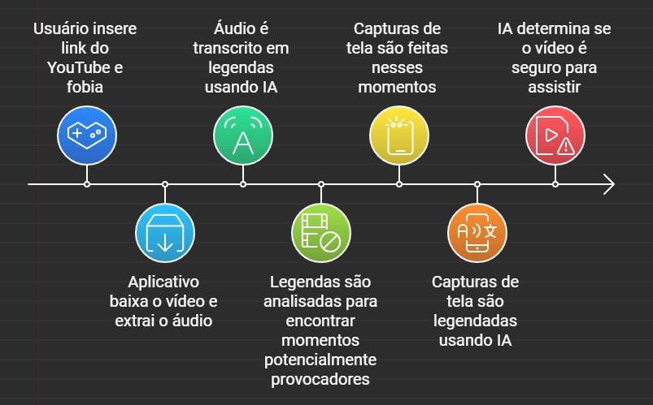

# Phobia Advisor

Este é um sistema de análise de vídeos do YouTube, projetado para ajudar os usuários a evitar conteúdos relacionados a fobias. O usuário insere o link de um vídeo do YouTube e especifica uma fobia que deseja evitar. A aplicação processa o vídeo, analisa o conteúdo e retorna uma recomendação sobre se o vídeo contém ou não trechos relacionados à fobia especificada.

## Esquema


## Funcionalidades

- **Download de Vídeo**: Utiliza a biblioteca `pytubefix` para baixar o vídeo do YouTube.
- **Extração de Áudio**: Extrai o áudio do vídeo usando `MoviePy`.
- **Transcrição de Áudio**: Utiliza o modelo Whisper da OpenAI para transcrever o áudio em formato de legenda `.srt`.
- **Análise de Fobia**: Envia a transcrição ao modelo GPT-3.5, que identifica possíveis trechos do vídeo onde a fobia pode ser encontrada.
- **Extração de Frames**: Captura frames do vídeo nos segundos retornados pelo GPT-3.5.
- **Legendas de Imagens**: Utiliza o modelo BLIP para gerar legendas descritivas dos frames extraídos.
- **Recomendação Final**: Com base nas legendas e transcrição, o GPT-3.5 retorna se o vídeo contém ou não conteúdos relacionados à fobia e se o usuário deve assisti-lo.

## Estrutura do Projeto
`app.py`: Arquivo onde fica localizada a interface Gradio que o usuário tem acesso.  
`run_pipeline.py`: Arquivo principal que gerencia o fluxo de trabalho.
`baixar_video.py`: Arquivo que usa faz o download do vídeo.
`audio_extractor.py`: Extrai o áudio do vídeo.
`transcrever_audio.py`: Responsável pela transcrição do áudio usando Whisper.  
`lista_framesr.py`: Envia a transcrição ao GPT-3.5 para identificar frames relacionados à fobia.  
`gera_prints.py`: Extrai frames com base nos segundos retornados.  
`BLIP_model.py`: Usa o modelo BLIP para legendar os frames.  
`analise_final.py`: Recebe todos os outros outputs e envia para a LLM decidir se o usuário deve ou não assistir o vídeo.
`requirements.txt`: Lista das bibliotecas necessárias para rodar a aplicação.  


## Requisitos

- Python 3.8+
- Bibliotecas necessárias:
  - `pytubefix`
  - `moviepy`
  - `openai`
  - `whisper`
  - `torch`
  - `transformers`
  - `gradio`
  
## Instalação

1. Clone o repositório:
   ```bash
   git clone https://github.com/seuusuario/seurepositorio.git

2. Instale as dependências:
    ```bash
    pip install -r requirements.txt
3. Execute a aplicação:
     ```bash
    python app.py
